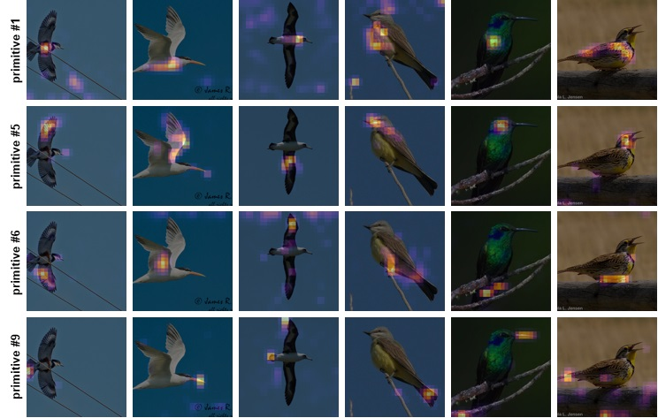

# 🧩 CoGe-GCD · ICML 2026

<div align="center">

[English](README.md) · [中文](README.zh-CN.md)

### Reframing Generalized Category Discovery with Compositional Generalization

> **ICML 2026 paper.** Accepted to the 43rd International Conference on Machine Learning.

[](https://icml.cc/)
[](https://github.com/lytang63/CoGe-GCD)
[](LICENSE)
[](https://arxiv.org/)

**Luyao Tang · Jiewei Zheng · Kunze Huang · Chaoqi Chen · Yue Huang · Cheng Chen**

The University of Hong Kong · Xiamen University · Shenzhen University

[Paper](ICML2026___CoGe_GCD__Reframing_Generalized_Category_Discovery_with_Compositional_Generalization__Camera_Ready_.pdf) · [Project page](https://github.com/lytang63/CoGe-GCD) · [arXiv ID pending](https://arxiv.org/) · [Quick start](#-quick-start)

</div>

---

<div align="center">

<table>
<tr>
<td><b>Problem</b><br>Generalized Category Discovery</td>
<td><b>Core idea</b><br>Reusable primitives + geometric induction</td>
<td><b>Interface</b><br>Backbone → CoGe-GCD → GCD head</td>
</tr>
</table>

</div>

## 🌍 Why CoGe-GCD?

Generalized Category Discovery (GCD) asks a model to classify a mixture of labeled and unlabeled images into **known** and **novel** categories. In an open world, novel categories are often not arbitrary clusters: they emerge by recombining visual parts, attributes and relations that already appear in known categories.

Our central insight is that GCD needs two complementary capabilities:

- **Compositional Perception** — organize patch-level evidence into a compact vocabulary of reusable primitives before making category decisions.
- **Generalizing Induction** — reason over the geometry induced by those primitives and extrapolate to unseen combinations.

CoGe-GCD turns this insight into a lightweight plug-in between a visual backbone and an existing GCD head. The backbone, projection head, objective and clustering protocol remain unchanged.

<div align="center">

<br><em>From holistic token processing to compositional perception and generalizing induction.</em>
</div>

## 🚀 Use it in a few lines

CoGe-GCD is designed as a small, practical interface: instantiate one module and place it between the visual backbone and the existing GCD projection/head. The downstream loss, optimizer and clustering code can stay unchanged.

```python
from models.compositional import CompositionalPerception

module = CompositionalPerception(embed_dim=768, num_primitives=16, num_heads=8)
refined_tokens = module(patch_tokens)  # [batch, num_patches, embed_dim]
```

This codebase is built on the SelEx GCD implementation and exposes the same lightweight insertion point for other GCD frameworks. The interface can be integrated into **SimGCD, LegoGCD, CMS, SelEx**, or another ViT-based GCD pipeline with the same backbone-to-head boundary.

The interface is intentionally broader than one benchmark or one GCD recipe. We expect the same separation between reusable evidence and inductive discovery to transfer to many open-world tasks, including continual discovery, domain-shifted discovery and open-world recognition. We invite researchers to try the module with new tasks and backbones, and welcome feedback, failure cases and extensions.

## ✨ Method at a glance

<div align="center">

<br><em>Primitive competition and evidence consolidation structure patch tokens; geometric calibration preserves the induced relations.</em>
</div>

### 🔹 1 · Primitive competition

Image-conditioned primitive prototypes compete for token evidence through multi-head token–primitive similarities. Column-wise normalization encourages specialization instead of letting every primitive explain every patch.

### 🔹 2 · Evidence consolidation

Token evidence is pooled into primitive summaries and disseminated back to tokens. Coherent groups are amplified, while isolated or noisy patch associations are attenuated.

### 🔹 3 · Generalizing induction

The membership structure is calibrated with three perceptual relations:

- **Proximity:** nearby patches tend to share compatible evidence;
- **Continuity:** smooth contours should remain connected;
- **Similarity:** locally related tokens should exchange compatible support.

This preserves probabilistic memberships while producing a more structured substrate for known/novel decisions.

## 💡 Open-world insight

The key failure mode in conventional GCD is not simply weak clustering. Holistic embeddings can discard the intermediate structure needed to explain why a novel category is plausible. CoGe-GCD therefore separates *how evidence is organized* from *how novelty is inferred*:

```text
patch evidence → reusable primitives → calibrated relations → GCD decision
```

This decomposition gives the model a reusable vocabulary for open-world discovery: known classes provide primitives, while novel classes can be recognized as new compositions of them.

### 🌐 A general interface for open-world learning

The deeper idea is deliberately broader than one GCD benchmark. Whenever a task mixes partial supervision with emerging categories, a model can benefit from separating **evidence organization** (what reusable elements are present) from **inductive discovery** (which combinations constitute a new concept). CoGe-GCD provides this separation as a compact backbone-to-head interface, making it straightforward to explore open-world recognition, continual discovery, domain-shifted discovery and other settings where the category inventory evolves over time.

We hope researchers will try the interface in new open-world tasks, adapt it to their own backbones and objectives, and share feedback, failure cases and extensions with the community.

## 📊 Empirical evidence

CoGe-GCD is evaluated on six standard GCD benchmarks: CUB-200, Stanford Cars, FGVC-Aircraft, CIFAR-10, CIFAR-100 and ImageNet-100. Reported metrics include Known, Novel and All accuracy, as well as estimated category-count error and geometric indicators.

<div align="center">

<br><em>Fine-grained benchmark results.</em>
</div>

<div align="center">

<br><em>Coarse-grained benchmark results.</em>
</div>

The qualitative and spectral analyses show tighter discovered structure, lower effective rank and more object-centric primitive responses:

<div align="center">


</div>

### 🔎 Visualization of Primitives

Across samples—and even across categories—the same primitive index tends to attend to semantically corresponding regions. This cross-sample consistency suggests that primitives behave as reusable visual evidence rather than image-specific attention blobs.

<div align="center">




<em>Within each dataset, a fixed primitive index tracks similar regions across different images.</em>
</div>

## 🛠️ Installation

```bash
git clone https://github.com/lytang63/CoGe-GCD.git
cd CoGe-GCD
conda create -n coge-gcd python=3.9 -y
conda activate coge-gcd
pip install -r requirements.txt
```

The implementation uses Python 3.9+, PyTorch 2.0+, torchvision, timm, NumPy, SciPy, scikit-learn, Pillow, pandas, matplotlib, tensorboard, tqdm and `kmeans-pytorch`.

## ⚡ Quick start

Run commands from the repository root. Dataset and checkpoint locations are configured through `config.py` or `COGE_*` environment variables; see the full [usage guide](#-paths-and-data-preparation) below.

```bash
# Train the GCD representation
bash bash_scripts/contrastive_train.sh cifar100

# Extract features from a trained checkpoint
export WARMUP_MODEL_DIR=/path/to/checkpoints/
bash bash_scripts/extract_feats.sh cub

# Cluster and evaluate
bash bash_scripts/k_means.sh cub

# Estimate the number of categories
bash bash_scripts/estimate_k.sh cub
```

## 🗂️ Paths and data preparation

By default, datasets are expected below `data/datasets/`, pretrained weights below `pretrained_models/`, and outputs below `outputs/`. Override paths without editing source files:

```bash
export COGE_DATA_ROOT=/path/to/datasets
export COGE_DINO_PATH=/path/to/dino_vitbase16_pretrain.pth
export COGE_SPLIT_DIR=/path/to/ssb_splits
export COGE_EXP_ROOT=outputs/experiments
export COGE_FEATURE_DIR=outputs/features
```

Individual overrides such as `COGE_CUB_ROOT`, `COGE_CARS_ROOT`, `COGE_AIRCRAFT_ROOT`, `COGE_CIFAR100_ROOT` and `COGE_IMAGENET_ROOT` are also supported.

## 📜 Citation

```bibtex
@inproceedings{tangcoge,
  title={CoGe-GCD: Reframing Generalized Category Discovery with Compositional Generalization},
  author={Tang, Luyao and Zheng, Jiewei and Huang, Kunze and Chen, Chaoqi and Huang, Yue and Chen, Cheng},
  booktitle={Forty-third International Conference on Machine Learning}
}
```

## 📄 License

Released under the MIT License. Dataset and pretrained-model licenses remain the responsibility of the user.

## 🙏 Acknowledgements

This project builds on the open-source **SelEx: Self-Expertise in Fine-Grained Generalized Category Discovery** codebase. We thank the SelEx authors for releasing their implementation and supporting this work.
