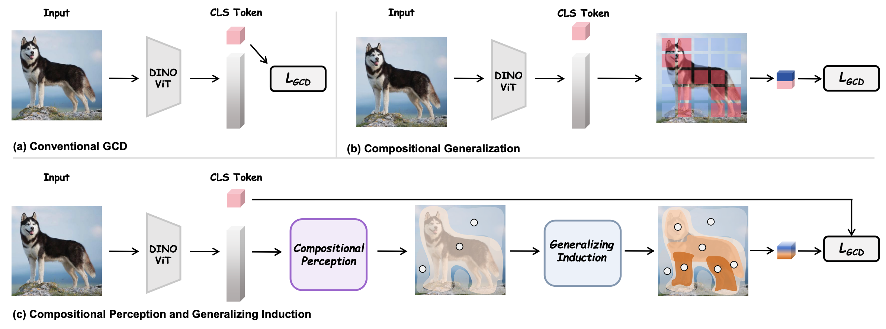
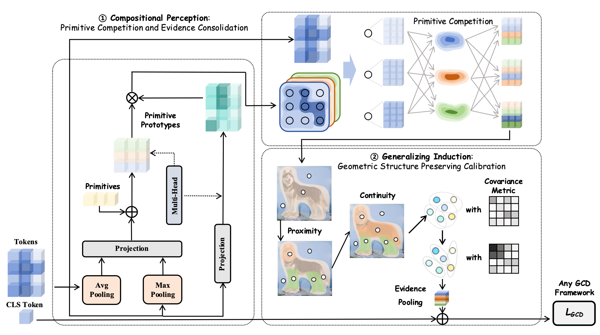
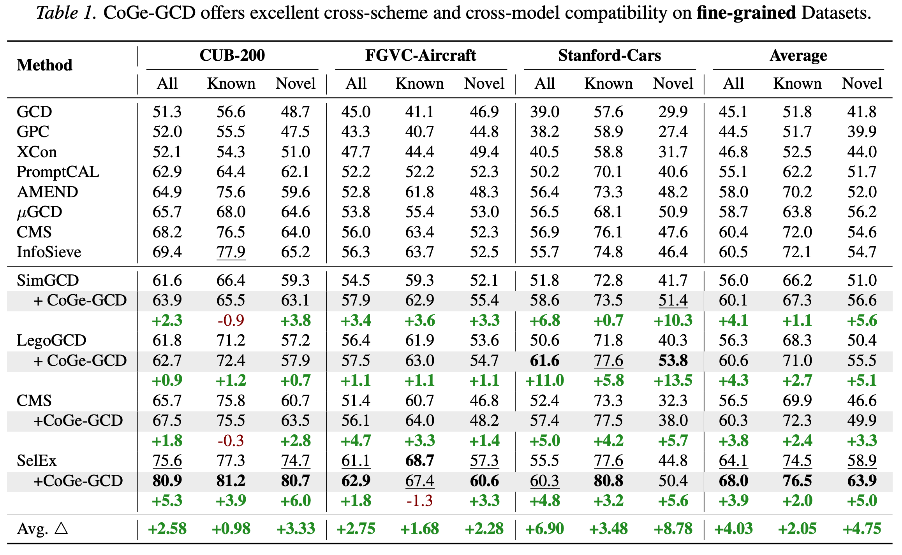
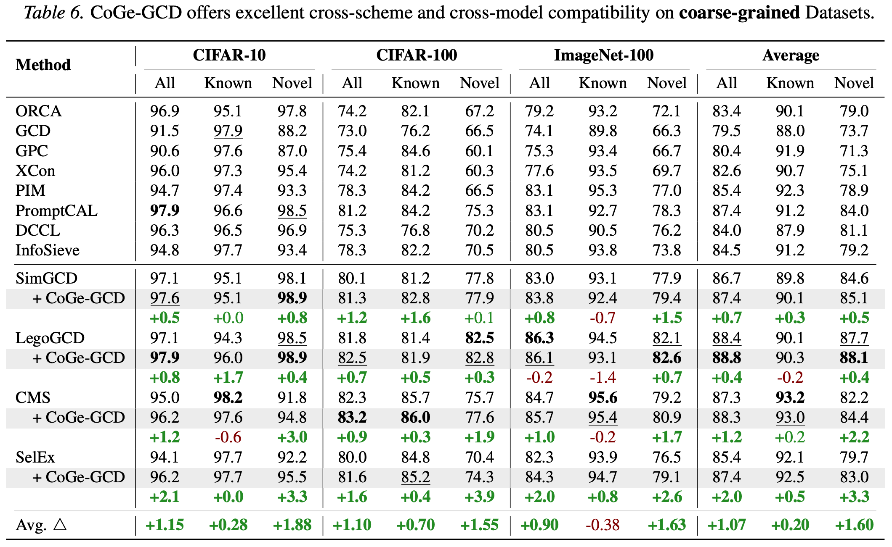
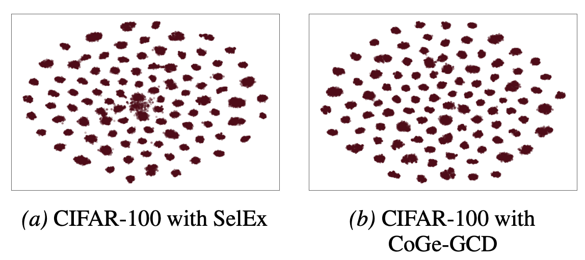
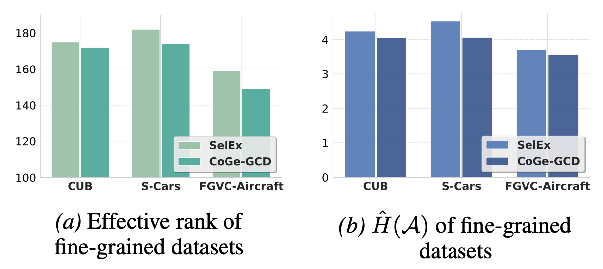
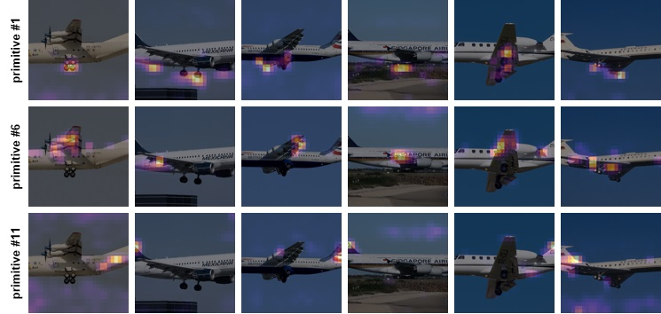
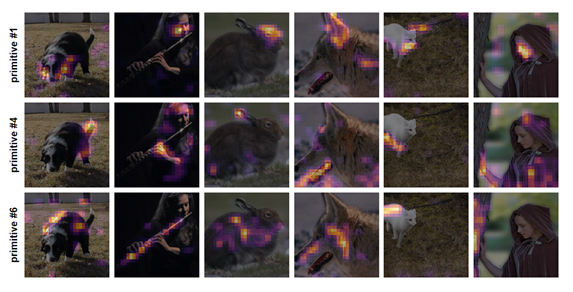
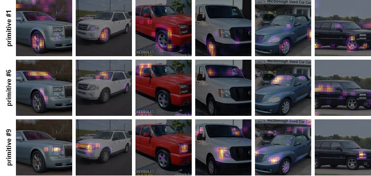

# 🧩 CoGe-GCD · ICML 2026

<div align="center">

[English](README.md) · [中文](README.zh-CN.md)

### Reframing Generalized Category Discovery with Compositional Generalization

> **ICML 2026 paper.** Accepted to the 43rd International Conference on Machine Learning.

[](https://icml.cc/)
[](https://github.com/lytang63/CoGe-GCD)
[](LICENSE)
[](https://arxiv.org/)

**Luyao Tang · Jiewei Zheng · Kunze Huang · Chaoqi Chen · Yue Huang · Cheng Chen**

The University of Hong Kong · Xiamen University · Shenzhen University

[Paper](ICML2026___CoGe_GCD__Reframing_Generalized_Category_Discovery_with_Compositional_Generalization__Camera_Ready_.pdf) · [Project page](https://github.com/lytang63/CoGe-GCD) · [arXiv ID pending](https://arxiv.org/) · [English README](README.md)

</div>

---

<div align="center">

<table>
<tr>
<td><b>问题</b><br>Generalized Category Discovery</td>
<td><b>核心思想</b><br>可复用 primitives + 几何归纳</td>
<td><b>接口</b><br>Backbone → CoGe-GCD → GCD head</td>
</tr>
</table>

</div>

## 🌍 为什么需要 CoGe-GCD？

Generalized Category Discovery（GCD）要求模型在带标签和无标签图像混合的情况下，同时识别 **known** 和 **novel** 类别。在开放世界中，novel 类别通常不是任意的孤立簇，而是由 known 类别中已经出现的视觉部件、属性和关系重新组合而来。

我们的核心观点是，GCD 需要两个互补能力：

- **Compositional Perception**：在做类别判断之前，将 patch-level evidence 组织成紧凑、可复用的 primitive 词汇；
- **Generalizing Induction**：在 primitive 所诱导的几何结构上进行归纳，并外推到未见过的组合。

CoGe-GCD 将这一思想实现为 visual backbone 与现有 GCD head 之间的轻量 plug-in，不改变 backbone、projection head、训练目标或 clustering protocol。

<div align="center">

<br><em>从整体 token 处理转向组合感知与归纳泛化。</em>
</div>

## 🚀 几行代码即可使用

CoGe-GCD 被设计成一个简单、实用的接口：实例化一个模块，将它放在 visual backbone 和现有 GCD projection/head 之间即可。下游 loss、optimizer 和 clustering 代码无需改动。

```python
from models.compositional import CompositionalPerception

module = CompositionalPerception(embed_dim=768, num_primitives=16, num_heads=8)
refined_tokens = module(patch_tokens)  # [batch, num_patches, embed_dim]
```

本代码基于 SelEx GCD implementation，并提供相同的轻量插入点，可用于 **SimGCD、LegoGCD、CMS、SelEx** 以及其他 ViT-based GCD pipeline。

这个接口并不局限于单个 benchmark 或单种 GCD recipe。我们期待“可复用 evidence + inductive discovery”的解耦方式迁移到 continual discovery、domain-shifted discovery、open-world recognition 等更多开放世界任务中。欢迎研究者尝试新的任务和 backbone，并分享反馈、失败案例与扩展方向。

## ✨ 方法概览

<div align="center">

<br><em>Primitive competition 与 evidence consolidation 组织 patch tokens，几何校准保留其关系结构。</em>
</div>

### 🔹 1 · Primitive competition

图像条件化的 primitive prototypes 通过 multi-head token–primitive similarity 竞争 token evidence。Column-wise normalization 鼓励不同 primitive 专注于不同模式，避免所有 primitive 覆盖相同 patch。

### 🔹 2 · Evidence consolidation

Token evidence 先聚合为 primitive summaries，再传播回 token。这样可以增强连贯的 token groups，并抑制孤立或噪声关联。

### 🔹 3 · Generalizing induction

Membership structure 通过三种感知关系进行校准：

- **Proximity**：相邻 patch 更可能共享兼容 evidence；
- **Continuity**：平滑轮廓应保持连续；
- **Similarity**：局部相关 token 应交换兼容支持。

该过程保持 probabilistic memberships，同时为 known/novel 决策提供更有结构的表示基础。

## 💡 开放世界 insight

传统 GCD 的关键问题不只是 clustering 不够强。Holistic embeddings 可能丢失解释 novel category 的中间结构。CoGe-GCD 将“如何组织 evidence”和“如何推断 novelty”明确分开：

```text
patch evidence → reusable primitives → calibrated relations → GCD decision
```

Known classes 提供可复用 primitives，novel classes 则可以被理解为这些 primitives 的新组合。

### 🌐 面向开放世界任务的通用接口

只要任务同时包含 partial supervision 和不断出现的新类别，就可以考虑将 evidence organization 与 inductive discovery 解耦。CoGe-GCD 将这种解耦封装为 backbone-to-head interface，便于迁移到类别集合会随时间变化的开放世界场景。

## 📊 实验结果

CoGe-GCD 在六个标准 GCD benchmark 上进行评估：CUB-200、Stanford Cars、FGVC-Aircraft、CIFAR-10、CIFAR-100 和 ImageNet-100。评估指标包括 Known、Novel、All accuracy、类别数估计误差和几何结构指标。

<div align="center">

<br><em>Fine-grained benchmark results.</em>
</div>

<div align="center">

<br><em>Coarse-grained benchmark results.</em>
</div>

定性和谱分析显示，CoGe-GCD 能带来更紧凑的 discovered structure、更低的 effective rank，以及更 object-centric 的 primitive responses：

<div align="center">


</div>

### 🔎 Visualization of Primitives

在不同样本之间，即使图像属于不同类别，相同 primitive index 也倾向于关注语义上对应的区域。这种跨样本一致性说明 primitive 更像是可复用的视觉 evidence，而不是只对单张图像有效的 attention pattern。

<div align="center">



<em>在每个数据集中，固定的 primitive index 会在不同图像中关注相似区域。</em>
</div>

## 🛠️ 安装

```bash
git clone https://github.com/lytang63/CoGe-GCD.git
cd CoGe-GCD
conda create -n coge-gcd python=3.9 -y
conda activate coge-gcd
pip install -r requirements.txt
```

依赖包括 Python 3.9+、PyTorch 2.0+、torchvision、timm、NumPy、SciPy、scikit-learn、Pillow、pandas、matplotlib、tensorboard、tqdm 和 `kmeans-pytorch`。

## ⚡ Quick start

请在 repository root 下运行以下命令。数据集和 checkpoint 路径可通过 `config.py` 或 `COGE_*` 环境变量配置。

```bash
# 训练 GCD representation
bash bash_scripts/contrastive_train.sh cifar100

# 从训练好的 checkpoint 提取特征
export WARMUP_MODEL_DIR=/path/to/checkpoints/
bash bash_scripts/extract_feats.sh cub

# 聚类与评估
bash bash_scripts/k_means.sh cub

# 估计类别数
bash bash_scripts/estimate_k.sh cub
```

## 🗂️ 数据路径配置

默认情况下，数据集位于 `data/datasets/`，预训练权重位于 `pretrained_models/`，输出位于 `outputs/`。可以通过以下环境变量覆盖：

```bash
export COGE_DATA_ROOT=/path/to/datasets
export COGE_DINO_PATH=/path/to/dino_vitbase16_pretrain.pth
export COGE_SPLIT_DIR=/path/to/ssb_splits
export COGE_EXP_ROOT=outputs/experiments
export COGE_FEATURE_DIR=outputs/features
```

也支持 `COGE_CUB_ROOT`、`COGE_CARS_ROOT`、`COGE_AIRCRAFT_ROOT`、`COGE_CIFAR100_ROOT` 和 `COGE_IMAGENET_ROOT` 等单独设置。

## 📜 Citation

```bibtex
@inproceedings{tangcoge,
  title={CoGe-GCD: Reframing Generalized Category Discovery with Compositional Generalization},
  author={Tang, Luyao and Zheng, Jiewei and Huang, Kunze and Chen, Chaoqi and Huang, Yue and Chen, Cheng},
  booktitle={Forty-third International Conference on Machine Learning}
}
```

## 📄 License

Released under the MIT License. Dataset and pretrained-model licenses remain the responsibility of the user.

## 🙏 Acknowledgements

This project builds on the open-source **SelEx: Self-Expertise in Fine-Grained Generalized Category Discovery** codebase. We thank the SelEx authors for releasing their implementation and supporting this work.
